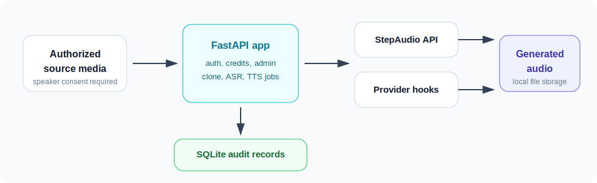

# StepAudio Voice Studio

[](https://github.com/ts370102633-hue/stepaudio-voice-studio/actions/workflows/ci.yml)
[](./LICENSE)

StepAudio Voice Studio is a self-hosted AI voice workflow app for authorized voice assets. It helps small content teams and developers upload approved audio or video samples, extract reference speech, create voice assets, generate TTS audio, and keep local audit records for users, credits, jobs, and generated files.

The project exists for teams that need a transparent alternative to closed internal voice automation tools. It is designed around consent, operator visibility, environment-based secret management, and self-hosted persistence.

This project is not intended for impersonation, unauthorized voice cloning, scraping, DRM bypass, paywall bypass, or rehosting media without rights.



## Why This Exists

Most voice-cloning products are closed systems: teams upload sensitive speaker material, generate audio, and then have limited visibility into storage, access, deletion, or audit behavior.

This repository provides an open reference implementation for a safer internal workflow:

- keep voice samples and generated output in operator-controlled storage
- require explicit consent before voice creation
- separate normal users from administrators
- persist job history instead of losing records on deploy
- keep provider API keys in environment variables, not source code
- document security and compliance responsibilities clearly

## Features

- Voice sample upload from audio or video files
- Automatic reference-audio preprocessing and speech segment selection
- StepAudio / StepFun API integration for ASR, voice clone, and TTS
- TTS generation with task history and downloadable audio
- Voice library with owner/admin access checks
- User accounts, invite codes, credits, and admin password management
- Persistent SQLite storage for users, tasks, settings, voice records, and video records
- Admin-managed platform cookies with masked previews
- Video/audio workflow hooks for authorized source media
- Queue-style video download processing with concurrency limits and failure reasons
- Production deployment notes for Linux, systemd, Nginx, HTTPS, and backups
- CI workflow and security-focused unit tests

## Intended Users

This project is useful for:

- content teams building an internal voiceover workflow
- developers who want a self-hosted voice asset management template
- teams that need auditable consent-based voice production
- maintainers experimenting with queue, storage, auth, and provider integration patterns
- organizations that prefer transparent infrastructure over opaque hosted voice tools

## Current Status

The project is pre-1.0 and production-capable for small internal teams that understand the operator responsibilities in [SECURITY.md](./SECURITY.md).

Recommended production posture:

- deploy behind HTTPS
- set a strong admin password
- keep SQLite and generated files outside the code checkout
- back up both database and file storage
- rotate any API key that has ever been exposed
- use only authorized voice samples and media sources

## Architecture

```text
Browser UI
  |
FastAPI application
  |
Persistent SQLite store
  |
Local generated-file storage
  |
External providers
  |- StepAudio / StepFun for ASR, voice clone, and TTS
  |- Optional licensed media retrieval providers
```

The default production deployment keeps runtime data outside the repository:

```text
DATABASE_URL=sqlite:////var/lib/stepaudio/stepaudio.db
LOCAL_STORAGE_DIR=/var/lib/stepaudio/files
```

See [Architecture](./docs/architecture.md) for more detail.

## Quick Start

Use Python 3.11 or 3.12. Python 3.14 is not recommended for this dependency set yet because several native Python packages may not publish wheels for it.

```bash
python3.12 -m venv .venv
source .venv/bin/activate
pip install -r requirements.txt
cp .env.example .env
```

Edit `.env`:

```bash
STEP_API_KEY=your_stepaudio_api_key
ADMIN_PASSWORD=change-this-before-use
APP_ENV=local
```

Run verification:

```bash
./init.sh
```

Start the app:

```bash
./start.sh
```

Open:

```text
http://localhost:8808
```

For a full walkthrough, see [Quickstart](./docs/quickstart.md).

## Environment Variables

| Variable | Purpose |
| --- | --- |
| `APP_ENV` | Use `local` for development and `production` for deployed servers. |
| `DATABASE_URL` | SQLite database URL. Use an absolute path in production. |
| `LOCAL_STORAGE_DIR` | Directory for generated audio, uploads, and downloaded files. |
| `CORS_ORIGINS` | Comma-separated production browser origins. Empty means same-origin only. |
| `STEP_API_KEY` | StepAudio / StepFun API key for clone, ASR, and TTS. |
| `STEP_API_BASE` | StepAudio plan API base URL. |
| `STEP_FILE_API_BASE` | StepFun file API base URL. |
| `STEP_ASR_MODEL` | ASR model name. |
| `STEP_TTS_MODEL` | TTS model name. |
| `ADMIN_USERNAME` | Initial administrator username. |
| `ADMIN_PASSWORD` | Initial administrator password. Must be changed for production. |

Optional variables for authorized media retrieval and diagnostics are documented in [.env.example](./.env.example) and [Deployment](./DEPLOYMENT.md).

## Documentation

- [Quickstart](./docs/quickstart.md)
- [Architecture](./docs/architecture.md)
- [Consent and safety model](./docs/consent-and-safety.md)
- [Deployment notes](./DEPLOYMENT.md)
- [Maintenance guide](./docs/maintenance.md)
- [Roadmap](./docs/roadmap.md)
- [Codex for Open Source application draft](./docs/codex-for-oss-application.md)

## Security And Compliance

Voice cloning has meaningful abuse risk. Operators must only process speakers and media they are authorized to use.

Included safeguards:

- API keys are loaded from environment variables
- production startup rejects the default admin password
- admin password can be changed in the UI
- password hashes use salted PBKDF2, with backward-compatible migration for older local installs
- production CORS defaults to same-origin only unless `CORS_ORIGINS` is set
- users can only access their own voice, TTS, and video records unless they are administrators
- generated audio and video download endpoints enforce owner/admin checks
- platform cookies are admin-only settings and API responses only expose masked previews

See [SECURITY.md](./SECURITY.md) and [Consent and safety model](./docs/consent-and-safety.md).

## Development

Install development dependencies:

```bash
pip install -r requirements-dev.txt
```

Run checks:

```bash
python -m compileall -q backend/app
python -m pytest -q
```

The GitHub Actions workflow runs the same checks on Python 3.11 and 3.12.

## Roadmap

The short-term roadmap is focused on maintainability and safe operations:

- background worker process for long-running clone, ASR, and TTS jobs
- consent audit export
- Docker Compose deployment example
- object storage backend for generated files
- role-based access control beyond admin/user
- broader FastAPI route tests
- release automation and changelog workflow

Open roadmap issues are tracked in GitHub Issues and summarized in [Roadmap](./docs/roadmap.md).

## Contributing

Contributions are welcome when they improve safety, maintainability, documentation, deployment reliability, tests, or authorized voice workflows.

Start with [CONTRIBUTING.md](./CONTRIBUTING.md). Please do not submit changes that bypass provider access controls, hide paid provider usage, or enable unauthorized voice cloning.

## License

MIT. See [LICENSE](./LICENSE).
